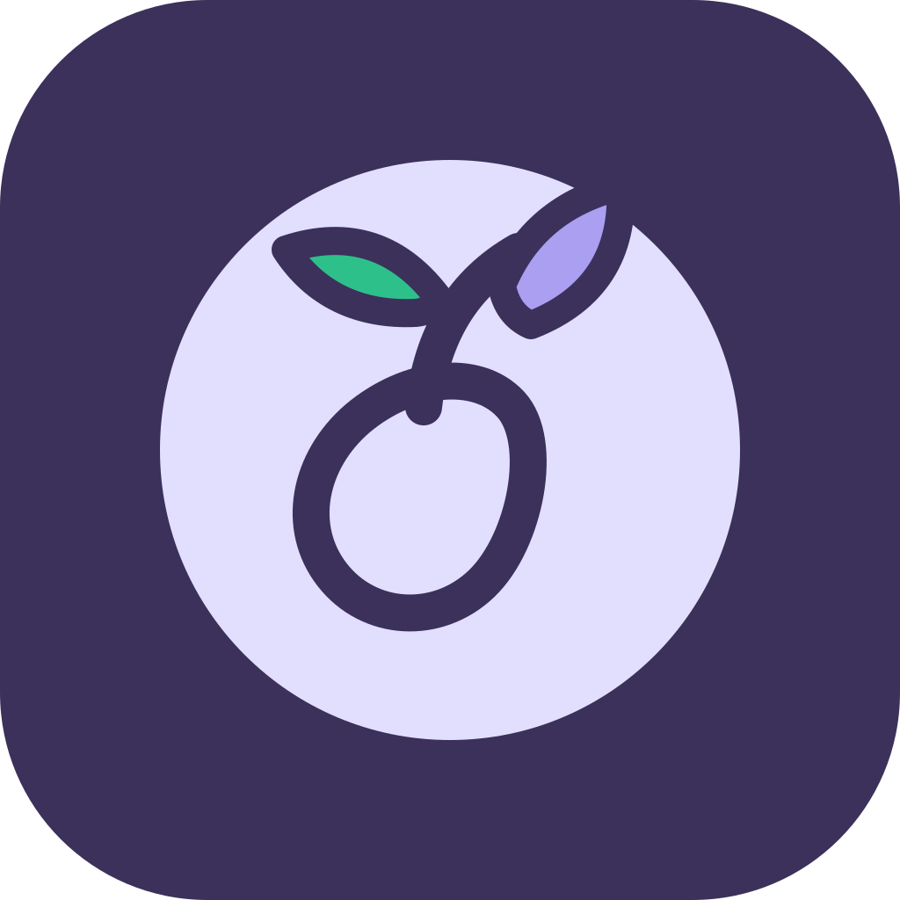
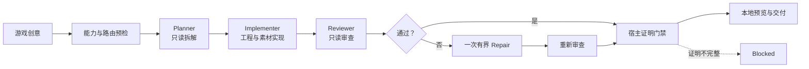
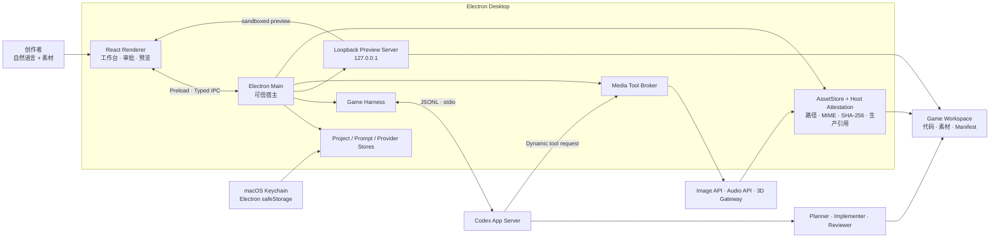

<p align="center">
  
</p>

<h1 align="center">LoopSeed</h1>

<p align="center">
  基于 Codex App Server 的桌面游戏制作 Agent<br>
  从一句自然语言创意，构建、审查并预览一个独立的浏览器游戏工程。
</p>

<p align="center">
  <code>Electron</code> · <code>React</code> · <code>TypeScript</code> · <code>Codex App Server</code> · <code>macOS</code>
</p>

> LoopSeed 把 Codex 放进一条有边界的游戏制作管线：Planner 先拆解，Implementer 在项目目录中实现，Reviewer 独立检查，宿主最后验证素材、代码引用与可运行结果。

## 核心能力

| 能力 | 说明 |
| --- | --- |
| 一句话创建游戏 | 创建独立项目目录，生成浏览器游戏工程，并在应用内通过 loopback 服务器实时预览。 |
| Codex 原生运行时 | Electron Main 启动 `codex app-server --listen stdio://`，通过 JSONL/stdio 管理线程、工具调用、审批与流式事件。 |
| 受控 Agent 管线 | 顺序执行只读 Planner、可写 Implementer、只读 Reviewer；失败时最多执行一次有界 Repair 与复审。 |
| 多模态素材 | 图片优先走已配置 API，否则回退 Codex ImageGen；音频支持音乐、语音、人声音效及程序化声音；3D 支持同步 REST 网关、自包含 GLB 与程序化 Three.js。 |
| 动画与帧率契约 | 每轮判断动画应生成、复用或不需要；`30 / 60 / 120 FPS` 驱动时序、动画元数据、素材变体和审查策略。 |
| 制作工作台 | 展示 8 个制作阶段、实时事件、命令与文件审批、本地预览、文件树和统一素材库。 |
| 可扩展设置 | 管理媒体 Provider、Codex Skills、stdio/HTTP MCP Server，以及 Planner、Implementer、Reviewer、Repair 的私有补充提示词。 |
| 素材导入 | 选择器可导入图片、音频和自包含 GLB；素材页支持拖入 PNG、JPEG、WebP 图片。 |

## 从创意到可玩工程



UI 中的 `Brief → Scaffold → GDD → Assets → World → Code → Verify → Complete` 用于展示制作进度；真正的完成条件由 Reviewer 和宿主证明共同决定。

## 系统架构



Renderer 不直接获得 shell、任意文件系统或 `child_process` 能力。Provider 密钥只在 Main 中解密和注入，不进入 Agent 参数、项目文件或 App Server JSON-RPC。

## 素材、动画与 FPS

| 类型 | 路由与验收 |
| --- | --- |
| 图片 | 启用的外部图片 API 优先；未配置或回退时使用 Codex ImageGen。项目完成前，宿主要求至少一张实际生成图片入库、SHA-256 匹配并被生产代码真实引用。 |
| 音乐 | 可路由 MiniMax Music 3.0；真实可用性由账户资格、区域、余额和首次生成共同决定。启用该路由时，完成门禁要求音乐文件落盘并由游戏代码播放。 |
| 语音 / 人声音效 | 可使用 MiniMax Speech、OpenAI Speech 或其他已配置 Provider；适合对白、喊声、喘息和生物人声。 |
| 通用音效 / 环境声 | 枪声、爆炸、脚步与环境底噪不会伪装成 MiniMax Speech 能力；使用已配置 Provider、导入素材、程序化 WAV 或 Web Audio。 |
| 3D | Meshy、Tripo、Rodin 目前按“同步 REST 网关”契约接入；也可导入自包含 GLB 2.0，或由 Agent 以 Three.js 程序化建模。 |

动画评估会选择 `generate`、`reuse` 或 `not-needed`：2D/2.5D 使用真实不同帧或 sprite sheet；rigged 3D 使用真实 GLB animation clip 与 mixer/action。单张图片整体平移或静态 mesh 位移不被当作角色关键帧动画。

目标 FPS 是制作与审查契约，不代表每秒生成 30、60 或 120 张图片，也不保证显示器实际输出 120 Hz。切换目标会让 Agent 审计 elapsed-time / fixed-step 时序、动画帧时长、source/target FPS 元数据和可用素材变体。

## 安全边界

- `BrowserWindow` 启用 `contextIsolation`、sandbox 与 `webSecurity`，关闭 `nodeIntegration`。
- API Key 经隔离 IPC 交给 Main，使用 Electron `safeStorage` 加密；macOS 上由 Keychain 支撑。
- 保存后 Renderer 只读取 `hasApiKey` 等状态，不回显密钥明文。
- 远端 Provider URL 要求 HTTPS；HTTP 只允许 localhost 开发网关。
- 素材 Manifest 被视为不可信输入；Main 会重新检查路径、symlink、MIME、大小、SHA-256、GLB 外部引用和生产代码引用。
- 每个项目在独立目录中运行；本地预览只绑定 `127.0.0.1`，不会自动发布到公网。

## 快速开始

需要 Node.js、npm，以及可用的 ChatGPT/Codex 账户。

```bash
git clone https://github.com/zaoshangduziteng/loopseed.git
cd loopseed
npm install
npm run dev
```

首次启动后，在“设置 → Codex 账户”中单独完成 ChatGPT 登录。LoopSeed 使用应用私有的 `userData/codex-home`，不会修改用户全局 `~/.codex`。

默认使用 `@openai/codex` 安装的当前平台二进制，并回退到 ChatGPT App 或 PATH 中的 Codex。也可显式覆盖：

```bash
NOOBI_CODEX_BIN=/absolute/path/to/codex npm run dev
```

`NOOBI_*` 环境变量和 `.noobi` 项目元数据作为与原始运行时的兼容层保留，不影响 LoopSeed 品牌和界面。

## 配置媒体服务

在“设置 → 媒体 API”中选择 Provider、模型与 Endpoint，并提交 API Key。外部 Provider 的设置检查只能确认当前探测能力；音乐资格、余额、区域限制和模型权限仍以第一次真实生成为准。

图片生成不是可选装饰：如果外部图片 API 与 Codex ImageGen 都不可用，Harness 会阻止启动，而不是用占位图伪装完成。3D 厂商预设当前要求同步返回媒体、base64 或同源 URL；厂商原生异步任务 API 需要先接入兼容网关。

## 验证

```bash
npm run verify          # typecheck + tests + production build
npm run smoke:codex     # Codex App Server
npm run smoke:harness   # 完整 Harness
npm run smoke:media     # 媒体路由
npm run smoke:image     # 图片生成契约
npm run smoke:ui        # 隔离数据的 Electron UI 截图
```

真实 Agent smoke 会使用已登录账户并消耗少量 Codex 或媒体 Provider 额度。

## macOS 打包

```bash
npm run package:mac
```

当前只定义 macOS DMG，并按执行构建的机器架构产出。公网分发前仍需配置 Developer ID Application、Apple notarization 与 staple；Intel Mac 需要在 x64 环境中单独构建。

## 当前边界

- 输出目标是独立浏览器游戏工程和本机 loopback 预览，不等于云部署、应用商店发布或原生 Unity / Unreal / Godot 导出。
- 生成质量、复杂度、可玩性与动画流畅度取决于模型、提示、依赖、素材/API 能力和审查结果；无法通过证明门禁的任务会标记为 `blocked`。
- 3D 厂商集成当前是同步 REST wrapper 契约，并非对每家厂商异步 API 的原生任务编排。
- 当前发行脚本以 macOS 为主，尚未提供 Windows / Linux release workflow。

## 文档

- [产品功能拆解](docs/PRODUCT_FUNCTIONS.md)
- [Codex App Server 架构](docs/ARCHITECTURE.md)
- [Codex 源码阅读基线](docs/CODEX_SOURCE_NOTES.md)
